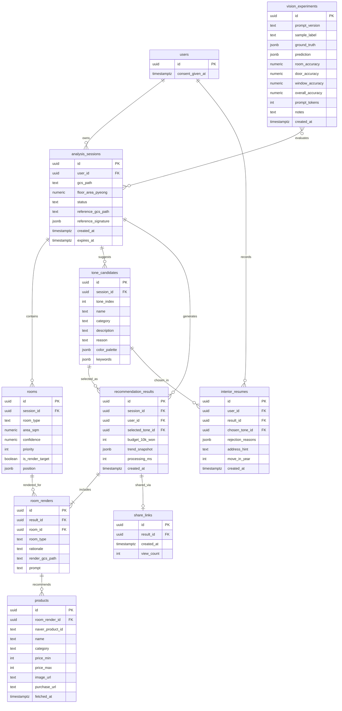
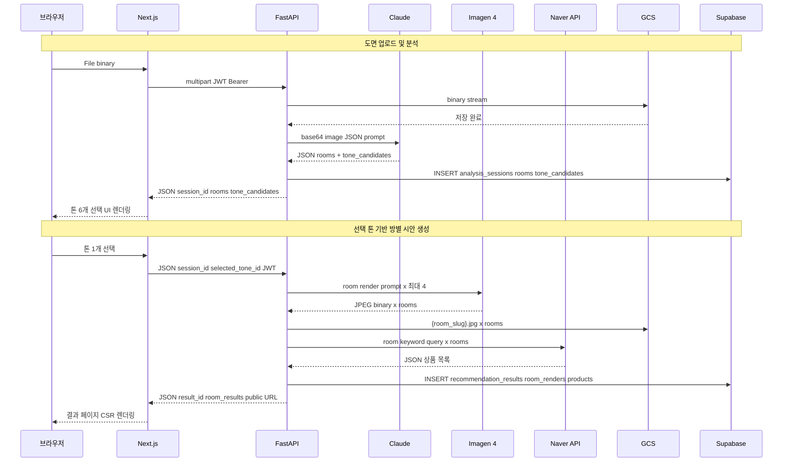
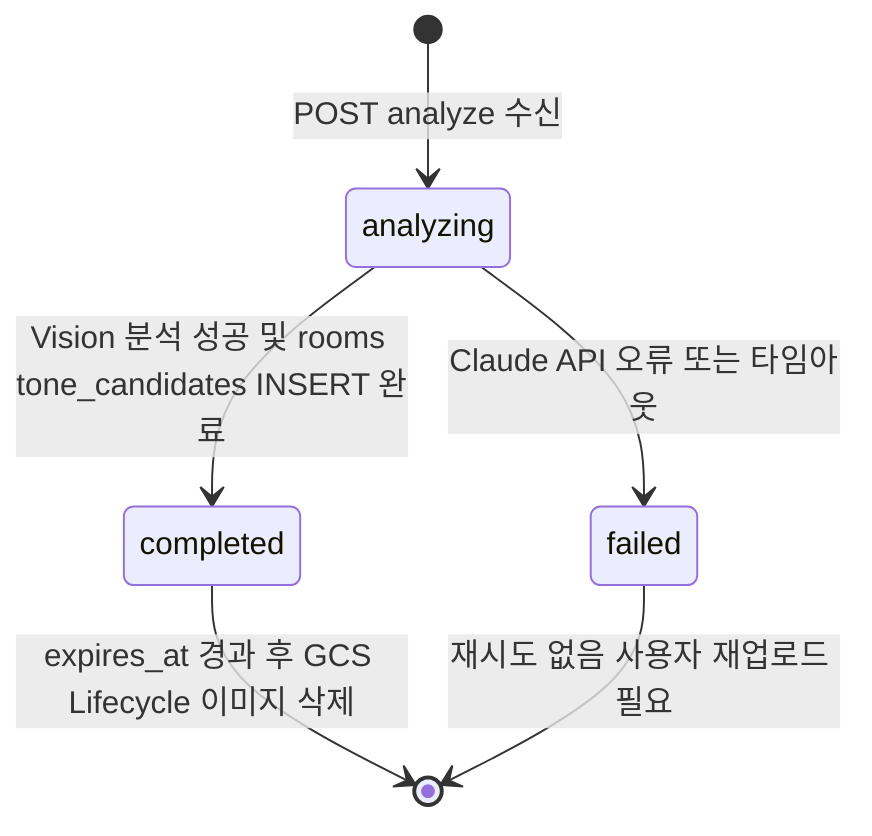
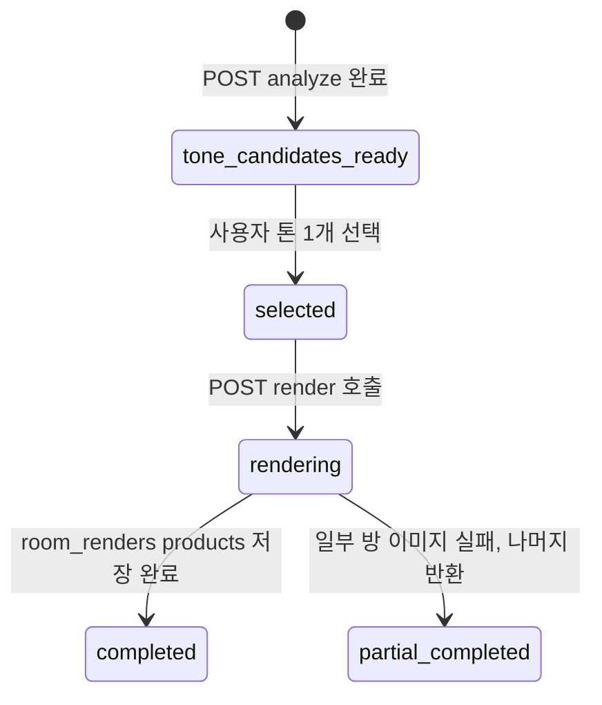

# Moodie · AI 인테리어 추천 서비스 — 데이터 모델

> 작성일: 2026-05-02 | KDT AI/LLM 과정 포트폴리오
> 기술 스택: Supabase PostgreSQL + GCP Cloud Storage + 메모리 캐시(TTLCache)

---

## 1. ERD (전체 관계도)



---

## 2. 저장소별 데이터 구조

### 2-1. Supabase PostgreSQL — MVP 10개 테이블

| 테이블 | 역할 | Phase |
|--------|------|-------|
| `users` | 인증 사용자 + 개인정보 동의 상태 | MVP |
| `analysis_sessions` | 도면 업로드 세션 + GCS 경로 + 만료일 | MVP |
| `rooms` | Vision 분석 방 이름·방 개수·렌더링 우선순위 | MVP |
| `tone_candidates` | 도면 기반 AI 추천 톤 6개 | MVP |
| `recommendation_results` | 사용자가 선택한 톤 기준 결과 헤더 | MVP |
| `room_renders` | 선택 톤으로 생성한 방별 이미지와 근거 | MVP |
| `products` | 네이버쇼핑 상품 (방별 3~5개) | MVP |
| `share_links` | 공유 링크 UUID + 조회수 | MVP |
| `vision_experiments` | 프롬프트 버전별 정확도 R&D 기록 | MVP |
| `interior_resumes` | 선택 톤·거절 이유 이력 | Phase 3 |

**MVP 제외/Phase 2 후보:**
- `openings` — 문·창문 위치 인식 및 수정 UI는 MVP에서 제외
- `styles.svg_layout` — SVG 2D 배치도는 MVP에서 제외
- `pdf` 저장용 별도 테이블 — MVP는 공유 링크 우선

### 2-2. GCP Cloud Storage — 파일 구조

```
bucket: {project-id}-interior/
│
├── floor-plans/
│   └── {user_id}/
│       └── {session_id}/
│           └── original.{jpg|png}     # 원본 도면 — 30일 TTL (Lifecycle 정책)
│
├── references/                        # private (레퍼런스 이미지 — 개인정보 준용)
│   └── {user_id}/
│       └── {session_id}/
│           └── original.{jpg|png}     # 사용자 업로드 레퍼런스 — 30일 TTL
│
└── renders/                           # public 접근 허용 (AI 생성물 — 개인정보 아님)
    └── {result_id}/
        ├── livingroom.jpg             # 방별 Imagen 렌더링 — 30일 TTL
        ├── kitchen.jpg
        ├── master_bedroom.jpg
        └── room_4.jpg                 # 주요 방 최대 4개
```

**접근 방식:**
- `floor-plans/` (도면): **private**. FastAPI가 Signed URL(TTL 15분) 생성. RISK-02 적용.
- `references/` (레퍼런스): **private**. 도면과 동일 정책. GCS URL을 응답에 포함하지 않음.
- `renders/` (AI 렌더링): **public**. 고정 URL `https://storage.googleapis.com/{bucket}/renders/...` 사용. `og:image` 영구 참조 가능.

### 2-3. TTLCache — 메모리 캐시

```python
# backend/core/cache.py
from cachetools import TTLCache

trend_cache = TTLCache(maxsize=100, ttl=86400)  # 24시간

# 키 구조
key = f'tone-trend:{year}'
# 예: 'tone-trend:2026'

# 값 구조
value = {
  'keywords': ['원목', '라탄', '베이지'],
  'color_palette': [{'name': '오프화이트', 'hex': '#F5F0E8'}],
  'description': '...',
  'searched_at': '2026-05-02T10:00:00Z'
}
```

---

## 3. 테이블 상세 명세

### users

Supabase `auth.users`를 그대로 사용하되, 개인정보 동의 상태만 `public.users`에 별도 보관.

| 컬럼 | 타입 | 제약 | 설명 |
|------|------|------|------|
| `id` | uuid | PK | Supabase auth.users.id 참조 |
| `consent_given_at` | timestamptz | nullable | 개인정보 수집 동의 시각. null이면 동의 전 → 업로드 차단 |

---

### analysis_sessions

도면 1회 업로드 = 세션 1개. GCS 이미지와 1:1 대응.

| 컬럼 | 타입 | 제약 | 설명 |
|------|------|------|------|
| `id` | uuid | PK DEFAULT gen_random_uuid() | 세션 ID |
| `user_id` | uuid | FK → users.id | 소유 사용자 |
| `gcs_path` | text | NOT NULL | `floor-plans/{uid}/{sid}/original.jpg` — Signed URL 생성 키 |
| `floor_area_pyeong` | numeric(5,1) | NOT NULL | 공급면적(평). 상품 검색 쿼리·예산 추정 기준 |
| `status` | text | CHECK IN (analyzing, completed, failed) | 분석 진행 상태 |
| `reference_gcs_path` | text | nullable | `references/{uid}/{sid}/original.{jpg\|png}` — 레퍼런스 이미지 GCS 경로. 없으면 NULL |
| `reference_signature` | jsonb | nullable | Claude Vision으로 레퍼런스에서 추출한 톤 시그니처. 구조: `{primary_hex, secondary_hex, accent_hex, materials[], style_tokens[], lighting, mood}` |
| `created_at` | timestamptz | DEFAULT now() | |
| `expires_at` | timestamptz | NOT NULL | created_at + 30일. GCS Lifecycle 삭제 기준 날짜와 동기화 |

**마이그레이션:** `supabase/migrations/0005_add_reference_image.sql`

---

### rooms

Vision 분석으로 추출된 방 정보. MVP에서는 사용자 수정 없이 `render` 호출 시 이미지 생성 대상 방을 고르는 기준으로 사용한다.

| 컬럼 | 타입 | 제약 | 설명 |
|------|------|------|------|
| `id` | uuid | PK | |
| `session_id` | uuid | FK → analysis_sessions.id ON DELETE CASCADE | |
| `room_type` | text | NOT NULL | 거실, 침실1, 침실2, 욕실, 주방, 발코니, 다용도실 |
| `area_sqm` | numeric(6,2) | | Vision 추정 면적(㎡) |
| `confidence` | numeric(4,3) | CHECK 0~1 | Vision 신뢰도 점수 |
| `priority` | int | | 이미지 생성 우선순위. 거실 → 주방 → 안방 → 작은방 |
| `is_render_target` | boolean | DEFAULT false | MVP 이미지 생성 대상 여부. 최대 4개 |
| `position` | jsonb | | `{x, y, w, h}` — 도면 이미지 내 상대 좌표(0~1) |

**`position` JSONB 구조:**
```json
{ "x": 0.05, "y": 0.10, "w": 0.35, "h": 0.40 }
```
도면 이미지의 가로·세로를 각각 0~1로 정규화한 상대 좌표. MVP에서는 필수 렌더링 데이터가 아니라, 추후 오버레이 UI 확장용 보조 데이터다.

---

### tone_candidates

`POST /analyze`에서 생성되는 도면 기반 인테리어 톤 6개. 사용자는 이 중 하나를 선택하고, 선택된 톤만 방별 이미지 생성에 사용한다.

| 컬럼 | 타입 | 제약 | 설명 |
|------|------|------|------|
| `id` | uuid | PK | |
| `session_id` | uuid | FK → analysis_sessions.id ON DELETE CASCADE | |
| `tone_index` | int | CHECK 1~6 | 화면 표시 순서 |
| `name` | text | NOT NULL | 예: "호텔라이크", "재팬디 내추럴" |
| `category` | text | | luxury, natural, minimal, color, trendy, practical 등 다양성 카테고리 |
| `description` | text | | 한 줄 컨셉 설명 |
| `reason` | text | | 도면 구조에 이 톤이 맞는 이유 |
| `color_palette` | jsonb | | 컬러 팔레트 배열 |
| `keywords` | jsonb | | 렌더링·상품 검색에 사용할 키워드 |

**`color_palette` JSONB 구조:**
```json
[
  { "name": "웜 화이트", "hex": "#F7F3EA", "role": "벽·천장" },
  { "name": "딥 월넛", "hex": "#5B3A29", "role": "가구" }
]
```

---

### recommendation_results

선택한 톤 하나에 대한 최종 결과 헤더. 방별 이미지는 `room_renders`에 저장한다.

| 컬럼 | 타입 | 제약 | 설명 |
|------|------|------|------|
| `id` | uuid | PK | |
| `session_id` | uuid | FK → analysis_sessions.id | 세션 참조 |
| `user_id` | uuid | FK → users.id | JWT 검증으로 추출한 user_id |
| `selected_tone_id` | uuid | FK → tone_candidates.id | 사용자가 선택한 톤 |
| `budget_10k_won` | int | nullable | 예산(만원). null이면 예산 미지정. 상품 검색 쿼리 기준 |
| `trend_snapshot` | jsonb | | Web Search 결과 스냅샷. 캐시 소멸 후에도 결과 재현 가능하도록 DB에 영구 저장 |
| `processing_ms` | int | | 전체 파이프라인 처리 시간(ms) — KDT 발표 성능 지표 |
| `created_at` | timestamptz | DEFAULT now() | |

**`trend_snapshot` JSONB 구조:**
```json
{
  "searched_at": "2026-05-02T10:00:00Z",
  "cache_hit": false,
  "trends": [
    {
      "tone": "재팬디",
      "rank": 1,
      "keywords": ["원목", "라탄", "베이지", "오프화이트"],
      "colors": [
        { "name": "오프화이트", "hex": "#F5F0E8" },
        { "name": "원목 브라운", "hex": "#8B6914" }
      ],
      "description": "자연 소재와 절제된 라인..."
    }
  ]
}
```
`cache_hit: false`이면 이 요청에서 Claude Web Search를 실제 호출한 것. 비용 추적 가능.

---

### room_renders

선택 톤으로 생성한 방별 이미지와 추천 근거. MVP에서는 주요 방 최대 4개만 생성한다.

| 컬럼 | 타입 | 제약 | 설명 |
|------|------|------|------|
| `id` | uuid | PK | |
| `result_id` | uuid | FK → recommendation_results.id ON DELETE CASCADE | |
| `room_id` | uuid | FK → rooms.id | 어떤 방의 시안인지 |
| `room_type` | text | NOT NULL | 공유 링크 조회 시 JOIN 없이 표시하기 위한 중복 필드 |
| `rationale` | text | | 방별 추천 근거 2~3줄 |
| `render_gcs_path` | text | | `renders/{result_id}/{room_slug}.jpg` |
| `prompt` | text | | Imagen 생성 프롬프트. 재현·디버깅용 |

---

### products

네이버쇼핑 API 검색 결과. 방별 3~5개 상품을 `room_renders`에 연결한다.

| 컬럼 | 타입 | 제약 | 설명 |
|------|------|------|------|
| `id` | uuid | PK | |
| `room_render_id` | uuid | FK → room_renders.id ON DELETE CASCADE | |
| `naver_product_id` | text | | 네이버쇼핑 상품 고유 ID |
| `name` | text | NOT NULL | 상품명 |
| `category` | text | | 소파, 침대, 조명, 테이블, 의자, 수납, 카펫 등 |
| `price_min` | int | | 최저가(원) |
| `price_max` | int | | 최고가(원) |
| `image_url` | text | | 네이버쇼핑 썸네일 URL |
| `purchase_url` | text | | 구매 링크 |
| `fetched_at` | timestamptz | DEFAULT now() | 검색 시점 — 면책 문구 "가격·재고는 검색 시점 기준" 표시용 |

---

### share_links

공유 링크 UUID = 이 테이블의 `id`. `/share/{id}` 경로로 SSR.

| 컬럼 | 타입 | 제약 | 설명 |
|------|------|------|------|
| `id` | uuid | PK DEFAULT gen_random_uuid() | 공유 URL에 노출되는 UUID |
| `result_id` | uuid | FK → recommendation_results.id UNIQUE | 결과당 1개 |
| `created_at` | timestamptz | DEFAULT now() | |
| `view_count` | int | DEFAULT 0 | 조회수 |

---

### vision_experiments

KDT 발표 핵심 근거. 프롬프트 버전 v1→v2→v3 정확도 향상 곡선을 이 테이블로 생성.

| 컬럼 | 타입 | 제약 | 설명 |
|------|------|------|------|
| `id` | uuid | PK | |
| `prompt_version` | text | NOT NULL | v1 (기본), v2 (Few-shot), v3 (CoT+도메인사전) |
| `sample_label` | text | NOT NULL | 예: "25평형_LH_01", "33평형_LH_03" |
| `ground_truth` | jsonb | NOT NULL | 수동 작성 정답: `{rooms, doors, windows}` |
| `prediction` | jsonb | | Claude 예측 출력 |
| `room_accuracy` | numeric(4,3) | | 방 인식 정확도 (0~1) |
| `door_accuracy` | numeric(4,3) | | 문 인식 정확도 |
| `window_accuracy` | numeric(4,3) | | 창문 인식 정확도 |
| `overall_accuracy` | numeric(4,3) | | 종합 정확도 |
| `prompt_tokens` | int | | 입력 토큰 수 (비용 추적) |
| `notes` | text | | 관찰 사항 자유 기록 |
| `created_at` | timestamptz | DEFAULT now() | |

**`ground_truth` / `prediction` JSONB 구조 (공통):**
```json
{
  "rooms": [
    { "type": "거실", "area_sqm": 18.5 },
    { "type": "침실1", "area_sqm": 9.2 }
  ],
  "doors": [
    { "location": "거실 북쪽 벽", "connects": "현관" }
  ],
  "windows": [
    { "location": "거실 남쪽 벽" },
    { "location": "침실1 동쪽 벽" }
  ]
}
```
`ground_truth`는 수동으로 작성한 정답. `prediction`은 Claude 출력 그대로 저장. 두 값을 비교해서 `*_accuracy` 컬럼 계산.

---

### interior_resumes

Phase 3. 이번 이사 선택을 기록해 다음 이사 때 컨텍스트로 사용.

| 컬럼 | 타입 | 제약 | 설명 |
|------|------|------|------|
| `id` | uuid | PK | |
| `user_id` | uuid | FK → users.id | |
| `result_id` | uuid | FK → recommendation_results.id | 어떤 추천 결과에서 선택했나 |
| `chosen_tone_id` | uuid | FK → tone_candidates.id | 최종 선택한 톤 |
| `rejection_reasons` | jsonb | | 선택하지 않은 톤과 이유 |
| `address_hint` | text | | 지역 힌트(서울, 경기 등) — 다음 이사 예산 보정용, 정확한 주소 아님 |
| `move_in_year` | int | | 이사 연도 — 향후 재추천 시 "3년 전 선택" 컨텍스트 |
| `created_at` | timestamptz | DEFAULT now() | |

**`rejection_reasons` JSONB 구조:**
```json
[
  { "tone_id": "uuid-b", "reason": "너무 어두움" },
  { "tone_id": "uuid-c", "reason": "가격 높음" }
]
```
선택하지 않은 톤에 대해 거절 이유 기록. 다음 이사 시 Claude 프롬프트 컨텍스트로 삽입 ("이전에 어두운 톤을 거절한 이력이 있습니다").

---

## 4. API 엔드포인트별 데이터 생성·저장·연결 흐름

### POST /analyze — 도면 분석

```
[입력] multipart: file(도면 이미지), floor_area_pyeong, reference(레퍼런스 이미지 — 선택)

① analysis_sessions 생성
   └── status = 'analyzing'
   └── expires_at = now() + 30일

② asyncio.gather() 병렬 실행 — GCS 업로드와 Vision 분석을 동시에
   ├── GCS 업로드: floor-plans/{user_id}/{session_id}/original.jpg
   │     └── 완료 후 analysis_sessions.gcs_path 업데이트
   └── Claude Vision 호출 (multipart 수신 시 메모리 내 binary → 즉시 base64 변환)
         └── GCS 업로드 완료를 기다리지 않고 분석 즉시 시작 (P-01 개선)
         └── MVP 프롬프트: 방 이름 추출 → 방 개수 → 주요 방 우선순위
         └── Structured Output → JSON 강제

② (선택) 레퍼런스 이미지 첨부 시 — asyncio.gather() 병렬 실행
   ├── GCS 업로드: references/{user_id}/{session_id}/original.{jpg|png}
   └── Claude Vision 호출 (레퍼런스 톤 시그니처 추출)
         └── 추출 결과: {primary_hex, secondary_hex, accent_hex, materials[], style_tokens[], lighting, mood}
         └── 실패 시 None → 기존 톤 생성 흐름 계속 (graceful degrade)
   └── UPDATE analysis_sessions SET reference_gcs_path, reference_signature

③ rooms 생성 (Vision 출력 rooms 배열 순회)
   └── 거실/주방/안방/작은방 우선순위 부여
   └── is_render_target = true 는 최대 4개 방만 설정

④ tone_candidates 6개 생성
   └── Claude Web Search + 도면 JSON 기반
   └── 레퍼런스 시그니처 있을 때: 6개 모두 시그니처 시드 기반 변주 (라이트/다크/웜/쿨/소프트/볼드)
   └── 레퍼런스 없을 때: 기존 고급/자연/미니멀/컬러/트렌디/실용 다양성 강제

⑤ analysis_sessions.status = 'completed'

[반환] session_id + rooms[] + tone_candidates[] + warnings[] + has_reference(boolean)
```

**연결 관계:** `analysis_sessions` (1) → `rooms` (N), `tone_candidates` (6)

---

### POST /render — 선택 톤 기반 방별 시안 생성

```
[입력] session_id + selected_tone_id + budget_10k_won(선택)

① session_id 소유자 확인
   └── JWT user_id와 analysis_sessions.user_id 일치 확인

② render_targets 조회
   └── rooms WHERE is_render_target = true ORDER BY priority LIMIT 4

③ recommendation_results 생성
   └── selected_tone_id = 입력값
   └── budget_10k_won = 입력값 (null 허용)
   └── trend_snapshot = /analyze 단계의 톤 생성 근거 저장
   └── processing_ms = /render 전체 소요 시간

④ asyncio.gather() 병렬 실행 (~20~40초)
   ├── Imagen 4: 방별 이미지 생성 → GCS renders/{result_id}/{room_slug}.jpg (public)
   └── Naver API: 방별 3~5개 상품 검색
       return_exceptions=True — 1개 실패해도 나머지 반환

⑤ room_renders 생성
   └── room_id, room_type, rationale, render_gcs_path, prompt 저장

⑥ products 생성
   └── room_render_id 연결, fetched_at = now()

[반환] result_id + selected_tone + room_results[] (render_public_url 포함)
       ※ render_public_url: https://storage.googleapis.com/{bucket}/renders/{result_id}/{room_slug}.jpg
```

**연결 관계:** `analysis_sessions` → `recommendation_results` → `room_renders` → `products`

---

### POST /share — 공유 링크 발급

```
[입력] result_id

① share_links 생성
   └── id = gen_random_uuid() (이것이 공유 UUID)
   └── result_id 연결

[반환] share_url = 'https://{domain}/share/{share_links.id}'
```

**연결 관계:** `recommendation_results` → `share_links` (result_id FK)

---

### GET /share/{uuid} — 공유 링크 조회 (SSR)

```
[동작]
① share_links WHERE id = uuid 조회
② recommendation_results JOIN tone_candidates JOIN room_renders JOIN products 조회
③ room_renders.render_gcs_path → public URL 생성
④ share_links.view_count += 1
⑤ SSR: OG 메타태그 생성 (og:image = 첫 번째 방 렌더링 public URL)

[새로 생성되는 데이터] 없음 (view_count 업데이트만)
```

---

### POST /pdf — PDF 렌더링 (Phase 2)

```
[동작]
① result_id로 selected_tone + room_renders + products 조회
② room_renders.render_gcs_path → public URL 생성
③ WeasyPrint: HTML 템플릿 → PDF 바이너리

[새로 생성되는 데이터] 없음 (DB 읽기만)
[반환] PDF 바이너리 스트림 (Content-Disposition: attachment)
```

---

### vision_experiments — R&D 전용 (별도 스크립트)

```
서비스 API가 아닌 백오피스 스크립트로 직접 삽입.

① 샘플 도면 (LH 공공데이터, AI Hub) → Claude Vision 호출
② 예측 결과 prediction 저장
③ 수동 작성 정답 ground_truth 와 비교
④ room_accuracy / door_accuracy / window_accuracy 계산 후 저장

KDT 발표 시 이 테이블 데이터로 막대 그래프 생성:
  v1(기본) ~50% → v2(Few-shot) ~65% → v3(CoT+도메인사전) 80%+
```

---

## 5. 데이터 흐름 — Phase별 활성 테이블

```
Phase 1 MVP
  users ─────────────────────────────── 동의 상태 확인
  analysis_sessions ─────────────────── 도면 세션 생성
  rooms ──────────────────────────────── Vision 방 구성 결과 저장
  tone_candidates ────────────────────── 도면 기반 톤 6개 저장
  recommendation_results ─────────────── 선택 톤 결과 헤더
  room_renders + products ─────────────── 방별 이미지 + 상품
  share_links ────────────────────────── 공유 링크
  vision_experiments ─────────────────── 프롬프트 R&D 기록

Phase 2 (고도화)
  위 전체 유지 + openings/SVG/PDF/예산 추정 검토

Phase 3 (완성)
  interior_resumes ───────────────────── 이번 이사 기록
```

---

## 6. 데이터 이동 경로 및 변환

### 6-1. 전체 데이터 이동 흐름



---

### 6-2. 도면 이미지 변환 경로

도면 이미지는 시스템을 통과하면서 5번 형태가 바뀐다.

| 단계 | 데이터 형태 | 처리 주체 | 설명 |
|------|-----------|---------|------|
| 브라우저 선택 | `File` 객체 (binary) | 브라우저 | 파일 input에서 선택 |
| Next.js → FastAPI | `multipart/form-data` | Next.js | JWT Bearer 헤더 포함 HTTP 전송 |
| GCS 업로드 | binary stream | FastAPI | `google-cloud-storage` SDK 직접 스트리밍 |
| GCS 저장 | blob | GCS | Object Lifecycle 30일 TTL 적용 |
| DB 저장 | `gcs_path` text | Supabase | 경로 문자열만 저장. URL 저장 안 함 |
| Claude 분석 시 | base64 문자열 | FastAPI | GCS 업로드와 **동시에** 메모리 내 binary → base64 변환. GCS 완료 대기 없음 |
| 프론트 반환 시 | Signed URL (15분) | FastAPI | 도면 미리보기 필요 시 `generate_signed_url()` 생성. 응답 기본값은 미포함 |

---

### 6-3. Vision 분석 결과 변환 경로

Claude 자연어 출력이 DB 레코드로 변환되는 과정.

| 단계 | 데이터 형태 | 처리 주체 | 설명 |
|------|-----------|---------|------|
| Claude 응답 (raw) | JSON 문자열 | Claude Sonnet 4.6 | Structured Output 강제로 JSON 반환 |
| FastAPI 파싱 | Python dict | FastAPI | `json.loads()` + Pydantic 모델 검증 |
| 렌더 대상 판정 | boolean 추가 | FastAPI | 거실→주방→안방→작은방 우선순위로 `is_render_target` 지정 |
| DB 저장 | PostgreSQL rows | Supabase | `rooms`, `tone_candidates` bulk INSERT |
| 프론트 반환 | JSON array | FastAPI | `rooms`, `tone_candidates`, `warnings` 반환 |
| 사용자 선택 후 | selected_tone_id | 브라우저 → FastAPI | `/render` 호출 시 선택 톤만 전달 |

---

### 6-4. 트렌드 데이터 흐름

캐시 계층이 둘(메모리 + DB)이기 때문에 경로가 갈린다.

```
요청 도착
│
├── TTLCache Hit (24h 이내)
│     └── trend_snapshot.cache_hit = true
│         └── DB에 저장
│
└── TTLCache Miss
      └── Claude Web Search 호출 (비용 발생)
            └── 결과 → TTLCache 저장 (메모리, 24h)
                └── trend_snapshot.cache_hit = false
                    └── DB에 영구 저장 (캐시 소멸 후 공유 링크 재현용)
```

| 단계 | 데이터 형태 | 처리 주체 | 설명 |
|------|-----------|---------|------|
| 캐시 조회 | Python dict or None | FastAPI 메모리 | key = `tone-trend:2026` |
| 캐시 Miss | HTTP 응답 JSON | Claude Web Search Tool | 실시간 인터넷 검색 결과 |
| 캐시 저장 | TTLCache entry | FastAPI 메모리 | 인스턴스 재시작 시 소멸 |
| DB 저장 | JSONB `trend_snapshot` | Supabase | `cache_hit` boolean 포함해서 영구 저장 |

---

### 6-5. 렌더링 이미지 변환 경로

선택 톤 + 방 정보 → Imagen 프롬프트 → JPEG → GCS (public) → 고정 URL

| 단계 | 데이터 형태 | 처리 주체 | 설명 |
|------|-----------|---------|------|
| 입력 | selected_tone + room | FastAPI | 선택 톤, 방 이름, 방 우선순위, 컬러 팔레트 포함 |
| Imagen 프롬프트 | 자연어 텍스트 | Claude/FastAPI | 선택 톤과 방별 용도를 반영한 프롬프트 |
| 병렬 렌더링 | 비동기 최대 4개 | FastAPI | `asyncio.gather(..., return_exceptions=True)` |
| Imagen 응답 | JPEG binary | Vertex AI Imagen 4 | 1장 실패해도 나머지 방 결과 반환 |
| 워터마크 삽입 | JPEG binary | FastAPI PIL | AI기본법 고지 문구 삽입 후 GCS 업로드 |
| GCS 저장 | blob (public) | GCS | `renders/{result_id}/{room_slug}.jpg` — public 접근 허용 |
| DB 저장 | `room_renders.render_gcs_path` text | Supabase | 경로만 저장. URL 저장 안 함 |
| 프론트 반환 | 고정 public URL | FastAPI | `https://storage.googleapis.com/{bucket}/renders/...` |

---

### 6-6. 상품 데이터 흐름

| 단계 | 데이터 형태 | 처리 주체 | 설명 |
|------|-----------|---------|------|
| 키워드 생성 | 자연어 키워드 배열 | FastAPI | 선택 톤 + 방 이름 + 가구 유형 기반 키워드 |
| Naver API 호출 | HTTP GET (query params) | FastAPI | 방별 3~5개 검색. 주요 방 4개 기준 최대 20 병렬 |
| API 응답 | JSON array | Naver Shopping | `title`, `lprice`, `hprice`, `image`, `link` 필드 |
| DB 저장 | `products` rows | Supabase | `fetched_at = now()` — 면책 문구 근거값 |
| 프론트 반환 | JSON array | FastAPI | 썸네일 URL은 네이버 CDN URL 그대로 반환 (GCS 재업로드 없음) |

---

### 6-7. 시스템 경계 간 포맷 요약

| 경계 | 프로토콜 | 데이터 포맷 | 인증 방식 |
|------|---------|-----------|---------|
| 브라우저 → Next.js | HTTP/HTTPS | multipart, JSON | Supabase 세션 쿠키 |
| Next.js → FastAPI | HTTPS REST | JSON, multipart | JWT Bearer (Supabase 발급) |
| FastAPI → Claude | HTTPS | JSON (messages array + base64 image) | API Key (서버 환경변수) |
| FastAPI → Imagen | HTTPS | JSON (Vertex AI SDK) | GCP Service Account |
| FastAPI → Naver Shopping | HTTPS | query string | Client ID/Secret 헤더 |
| FastAPI → GCS (도면) | HTTPS | binary stream | GCP Service Account |
| FastAPI → GCS (렌더링) | HTTPS | binary stream (public 업로드) | GCP Service Account |
| FastAPI → Supabase | HTTPS | JSON (PostgREST) | Service Role Key |
| FastAPI → 브라우저 반환 | HTTPS | JSON (도면: Signed URL, 렌더링: public URL) | JWT 검증 완료 후 반환 |

---

### 6-8. 분석 세션 상태 전이



---

### 6-9. 톤 선택 상태 전이



---

### 6-10. 데이터 생명주기

| 데이터 | 생성 시점 | 활성 기간 | 만료·삭제 |
|--------|---------|---------|---------|
| 도면 이미지 (GCS) | POST /analyze | 30일 | GCS Object Lifecycle 자동 삭제 |
| 레퍼런스 이미지 (GCS) | POST /analyze (선택) | 30일 | GCS Object Lifecycle 자동 삭제. private 버킷 유지 |
| 렌더링 이미지 (GCS) | POST /render | 30일 | GCS Object Lifecycle 자동 삭제 |
| `analysis_sessions` | POST /analyze | 30일 (`expires_at`) | DB 레코드는 만료 후에도 존재. 이미지만 삭제됨 |
| `rooms`, `tone_candidates` | POST /analyze | 세션 종속 | analysis_sessions DELETE CASCADE |
| `recommendation_results` | POST /render | 영구 | 수동 삭제 없음. 30일 후 이미지만 없어짐 |
| `room_renders`, `products` | POST /render | 영구 | recommendation_results 종속 |
| `share_links` | POST /share | 영구 | 만료 없음. 30일 후 이미지 없는 링크로 남음 |
| Signed URL (도면) | 요청 시 생성 | 15분 | 자동 만료. DB 저장 안 함 |
| 렌더링 public URL | 2단계 GCS 업로드 시 | 30일 (GCS Lifecycle) | GCS 이미지 삭제 시 URL도 만료 |
| TTLCache 트렌드 | 첫 캐시 Miss | 24시간 | 인스턴스 재시작 또는 TTL 만료 시 소멸 |
| `trend_snapshot` (DB) | POST /render | 영구 | recommendation_results 와 함께 유지 |
| `vision_experiments` | R&D 스크립트 | 발표까지 | 발표 후 수동 삭제 가능 |

---

## 7. 주요 제약 & 설계 결정 이유

| 결정 | 이유 |
|------|------|
| `tone_candidates` 별도 테이블 | 톤 6개를 먼저 보여주고, 사용자가 선택한 톤만 렌더링해야 하므로 후보와 결과를 분리 |
| `gcs_path`만 저장, URL 미저장 | Signed URL은 15분 TTL로 매번 생성. URL 저장 시 만료 후 쓸모없는 데이터 누적 |
| `trend_snapshot`을 DB에 영구 저장 | TTLCache 소멸 후에도 공유 링크에서 결과 재현 가능해야 함 |
| `fetched_at` 상품 검색 시점 저장 | "가격·재고는 검색 시점 기준" 면책 문구의 실제 근거값 |
| `vision_experiments` 별도 테이블 | 운영 데이터와 R&D 데이터 혼재 방지. 발표 후 삭제 가능 |
| `consent_given_at` nullable | null = 동의 전. 타임스탬프로 동의 시각도 기록 (법적 근거 보존) |
| `renders/` public 접근 허용 | 도면(`floor-plans/`)과 달리 AI 생성물은 개인정보 아님. public으로 `og:image` 고정 URL 확보 |
| `gcs_url` 응답 미포함 | 브라우저는 업로드한 파일을 이미 보유. GCS URL 재반환 불필요. public URL 노출도 방지 |
| `reference_gcs_path` 응답 미포함 | RISK-02 동일 정책. 레퍼런스 이미지도 private 버킷. 필요 시 별도 Signed URL 엔드포인트 사용 |
| `reference_signature` DB 저장 | 레퍼런스 없이 `/render` 재호출 시에도 Imagen conditioning에 활용 가능 (세션 내 유지) |
| `room_renders` 도입 | 선택 톤 결과가 방별 이미지와 근거로 구성되므로 스타일 단위가 아닌 방 단위 저장이 필요 |
| `budget_10k_won` DB 저장 | 입력값 미저장 시 같은 result_id로 결과 재현 불가. recommendation_results에 포함 |
| 파이프라인 2단계 분리 | 톤 6개 추천 후 사용자가 1개를 선택해야 Imagen 비용이 발생한다. 선택 전 이미지 생성 금지 |
| GCS 업로드·Vision 분석 병렬화 | 업로드 완료 전에도 메모리 내 binary로 Claude 호출 가능. `/analyze` 응답 시간 단축 |

---

*작성: KDT AI/LLM 과정 개인 포트폴리오 | 문의: shark1011.sk@gmail.com*
