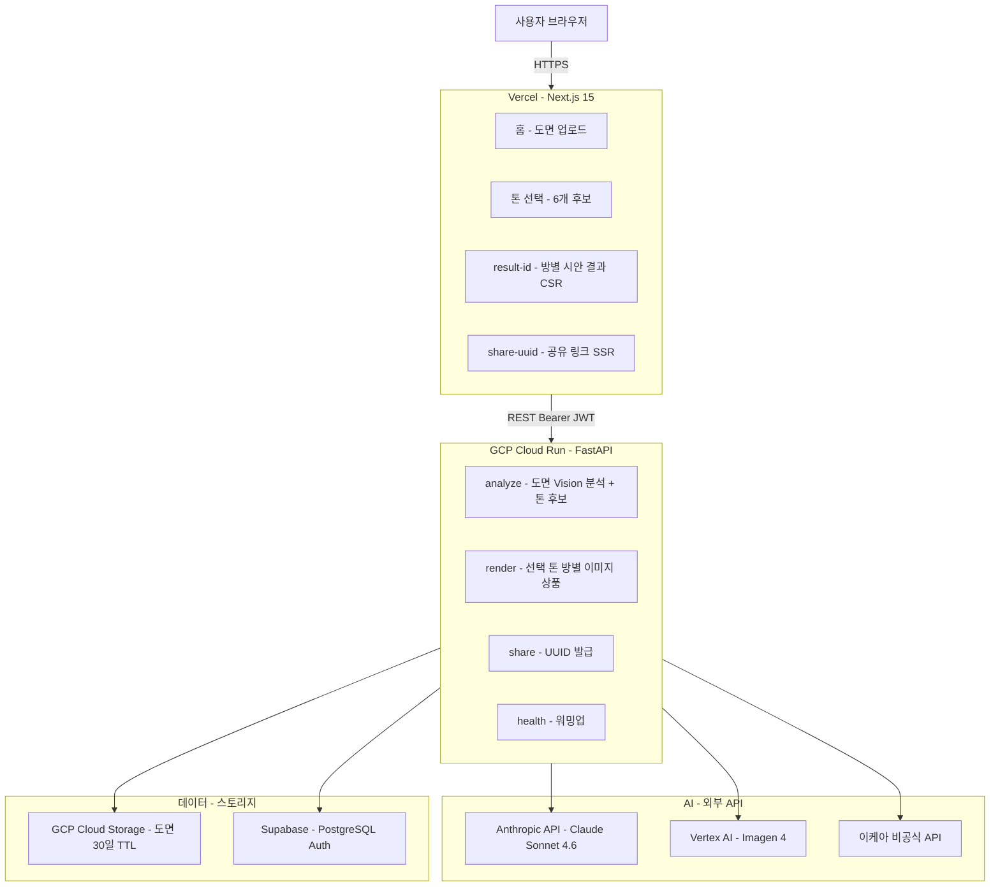
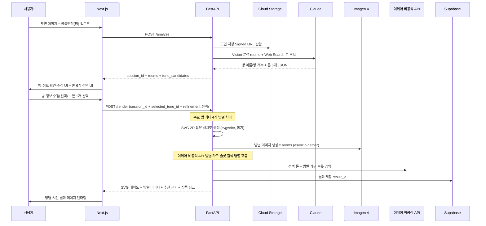
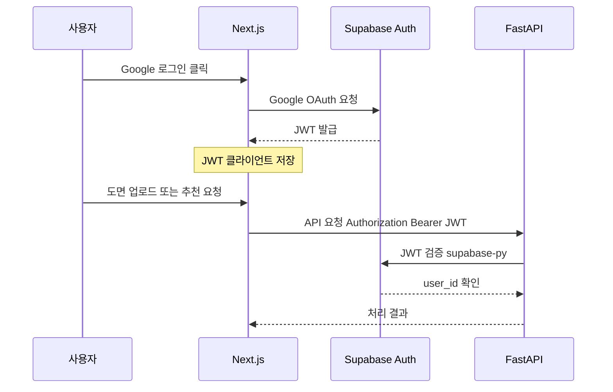

# AI 인테리어 추천 서비스 — 시스템 아키텍처

> 작성일: 2026-04-30 | KDT AI/LLM 과정 포트폴리오 + 개인 이사 도구
> 기술 스택 결정 문서: `기술스택_결정.md`
> **수익화 없음** — 정확도와 개인 사용성 최우선. Pro 플랜·B2B·어필리에이트 미포함.

---

## 0. Mermaid 다이어그램

### 0-1. 전체 시스템 배치



---

### 0-2. AI 처리 파이프라인 (POST /analyze → POST /render)



---

### 0-3. 인증 흐름 (Supabase JWT)



---

## 1. 전체 배치도

```
┌──────────────────────────────────────────────────────────────────┐
│  사용자 브라우저                                                   │
└────────────────────────┬─────────────────────────────────────────┘
                         │ HTTPS
                         ▼
┌──────────────────────────────────────────────────────────────────┐
│  Vercel  ·  Next.js 15 (App Router)                              │
│                                                                  │
│  /                   도면 업로드 + 톤 선택 UI                    │
│  /result/[id]        방별 시안 결과 (CSR — 동적 렌더링)          │
│  /share/[uuid]       공유 링크 (SSR — OG 메타태그 생성)          │
└────────────────────────┬─────────────────────────────────────────┘
                         │ REST API  (Authorization: Bearer <jwt>)
                         ▼
┌──────────────────────────────────────────────────────────────────┐
│  GCP Cloud Run  ·  FastAPI (Python 3.12)                         │
│                                                                  │
│  POST /analyze       도면 Vision 분석 + 톤 6개 추천              │
│  POST /render        선택 톤 기반 방별 이미지 + 상품 추천        │
│  POST /share         결과 저장 + 공유 UUID 발급                  │
│  GET  /health        Cold Start 워밍업 + 헬스체크                │
└──┬──────────┬─────────┬──────────┬──────────┬────────────────────┘
   │          │         │          │          │
   ▼          ▼         ▼          ▼          ▼
Anthropic  Vertex AI  이케아     Cloud     Supabase
API        (Imagen 4) 비공식     Storage   PostgreSQL
(Claude    (이미지    API       (도면      + Auth
 Vision +   방별 렌더링 (가구     임시       (Google
 Web        최대 4장) 검색)      저장)      OAuth)
 Search)
```

---

## 2. 레이어별 설명 및 결정 근거

### 2-1. Frontend — Next.js 15 (Vercel)

| 항목 | 선택 | 이유 |
|------|------|------|
| 프레임워크 | Next.js 15 App Router | `/share/[uuid]` SSR로 SNS OG 미리보기 필요 |
| 언어 | TypeScript | FastAPI Pydantic 스키마 → TS 타입 자동 생성 가능 |
| 스타일 | Tailwind CSS v4 | 4~6주 내 빠른 UI 조립 |
| 컴포넌트 | shadcn/ui | 업로드·카드·모달 컴포넌트 즉시 활용 |
| 배포 | Vercel | Next.js 네이티브, 무료 플랜으로 충분 |

**라우트 전략:**
- `/` — Client Component. 도면 업로드 + AI 자동/직접 입력 모드 선택
- `/analyze` — Client Component. 분석 대기 (polling, 모드별 API 분기)
- `/tones/[sessionId]` — Client Component. 톤 선택 (자동 6개 / 직접 입력 3개)
- `/render/[sessionId]` — Client Component. 렌더링 대기
- `/result/[id]` — Client Component (CSR). 방별 결과 + RefinementModal(정밀화 재요청)

### 2-2. Backend — FastAPI (GCP Cloud Run)

| 항목 | 선택 | 이유 |
|------|------|------|
| 프레임워크 | FastAPI (Python 3.12) | Anthropic SDK·PIL·Google Vertex AI SDK 통합 용이 |
| 비동기 | httpx + asyncio | 방별 Imagen 생성·이케아 API 병렬 호출로 대기 시간 최소화 |
| 스키마 검증 | Pydantic v2 | 프론트엔드 TS 타입과 스키마 공유 |
| 배포 단위 | Docker 컨테이너 | Cloud Run 표준. `gcloud run deploy` 한 줄로 배포 |
| 인스턴스 | 0~N 자동 스케일 | MVP는 min-instances=0. 발표 당일만 min=1로 임시 설정 |

**Cold Start 대응:**
- Cloud Run은 트래픽 없을 때 컨테이너 종료 → 첫 요청 1~3초 지연
- 발표 직전 `GET /health` 워밍업 호출 1회 필수

### 2-3. AI 처리 레이어

| 역할 | 기술 | 결정 근거 |
|------|------|---------|
| 도면 분석 + 톤 후보 생성 | Claude Sonnet 4.6 | Vision + Web Search Tool을 단일 SDK로 처리 |
| 방별 인테리어 이미지 렌더링 | Vertex AI Imagen 4 | 선택한 톤으로 주요 방 최대 4장 병렬 생성 |
| 상품 검색 키워드 생성 | Claude Sonnet 4.6 | 방 이름·선택 톤·예산 힌트를 상품 검색 쿼리로 변환 |

**Vision 정확도 한계 및 대응:**
- AECV-bench 기준 문(Door) ~26%, 창문(Window) ~14% 자동 인식
- MVP는 문·창문·정밀 배치 대신 **방 이름과 방 개수**를 핵심 추출 대상으로 제한
- 입력 도면은 아파트 분양도면·네이버 부동산 캡처처럼 한글 방명이 보이는 JPG/PNG로 제한
- 저신뢰도 결과는 사용자 보정 UI 대신 "분석 불가/재업로드" 안내 또는 낮은 확신도 표시로 처리

### 2-4. DB / 인증 / 스토리지

| 역할 | 기술 | 결정 근거 |
|------|------|---------|
| 관계형 DB | Supabase PostgreSQL | Cloud SQL 대비 무료($7~10/월 절감) |
| 인증 | Supabase Auth (Google OAuth) | NextAuth.js 설정 없이 30분 내 완성 |
| 도면 이미지 (`floor-plans/`) | GCP Cloud Storage | Object Lifecycle 30일 자동 삭제 — 개인정보보호법 준수. private, Signed URL(15분) |
| 렌더링 이미지 (`renders/`) | GCP Cloud Storage | Object Lifecycle 30일 자동 삭제. **public 접근 허용** — `og:image` 고정 URL 사용 |
| 트렌드 캐시 | cachetools TTLCache (24h) | Redis 인프라 불필요, 메모리 캐시로 충분 |

---

## 3. 통신 방식

### 3-1. 인증 흐름

```
브라우저 → Google OAuth (Supabase)
              └── Supabase JWT 발급
                   └── Next.js: Authorization: Bearer <jwt> 헤더에 포함
                        └── Cloud Run FastAPI: supabase-py로 JWT 검증
                             └── user_id 추출 → 요청 처리
```

### 3-2. API 엔드포인트 명세

#### POST /analyze
```
Request:
  Content-Type: multipart/form-data
  Body:
    file: File                  # 도면 이미지 (JPG/PNG, max 5MB)
    floor_area_pyeong: float    # 공급면적 (평)

Response: 200 OK
  {
    "session_id": "uuid",
    "rooms": [
      { "id": "uuid", "type": "거실", "confidence": 0.92, "priority": 1 },
      { "id": "uuid", "type": "주방", "confidence": 0.86, "priority": 2 }
    ],
    "tone_candidates": [
      {
        "id": "uuid",
        "name": "호텔라이크",
        "category": "luxury",
        "description": "차분한 뉴트럴 팔레트와 간접조명 중심",
        "reason": "거실과 안방이 분리된 구조라 고급스러운 휴식 무드가 잘 맞음"
      }
    ],
    "warnings": []
  }
  # tone_candidates 6개 (AI 자동 추천 모드)
```

#### POST /analyze/custom
```
Request:
  Content-Type: multipart/form-data
  Body:
    file: File                  # 도면 이미지 (JPG/PNG, max 5MB)
    floor_area_pyeong: float    # 공급면적 (평)
    user_text: str              # 원하는 분위기 자유 텍스트 (최대 500자)
    mood_chips: str             # JSON 배열 문자열 (예: '["모던","코지"]')

Response: 200 OK
  {
    "session_id": "uuid",
    "rooms": [...],             # POST /analyze와 동일 구조
    "tone_candidates": [
      {
        "id": "uuid",
        "tone_index": 1,        # 1=안전, 2=중립, 3=대담
        "name": "안전한 내추럴",
        "category": "natural",
        "description": "사용자 입력에 가장 충실한 보수적 해석",
        "reason": "입력하신 '따뜻한 베이지'를 충실히 반영한 안전한 선택"
      }
    ],
    "warnings": []
  }
  # tone_candidates 3개 (직접 입력 모드, tone_index 1·2·3)
```

#### POST /render
```
Request:
  Content-Type: application/json
  Body:
    {
      "session_id": "uuid",
      "selected_tone_id": "uuid",
      "budget_10k_won": 2500,           # 선택. 단위: 만원. 상품 추천 쿼리 보정
      "family_type": "couple",           # 선택. 가족 형태 힌트 (couple/family 등)
      "style_keywords": ["모던", "내추럴"], # 선택. 최대 3개 스타일 키워드
      "keep_appliances": true,           # 선택. 기존 가전 유지 힌트
      "appliances": [                    # 선택. 신혼 가전 배치 (정밀화 모달 입력값)
        { "name": "냉장고", "room": "주방" },
        { "name": "세탁기", "room": "다용도실" }
      ],
      "user_text": "수납 많이 해주세요"  # 선택. 추가 자유 텍스트 요청
    }

Response: 200 OK
  {
    "result_id": "uuid",
    "selected_tone": {
      "name": "호텔라이크",
      "description": "차분한 뉴트럴 팔레트와 간접조명 중심"
    },
    "room_results": [
      {
        "room_type": "거실",
        "rationale": "...",
        "render_url": "https://storage.googleapis.com/.../livingroom.jpg",
        "products": [
          {
            "name": "호텔라이크 3인 소파",
            "price_min": 480000,
            "price_max": 520000,
            "link": "https://...",
            "image_url": "https://..."
          }
        ]
      }
    ]
  }
```

### 3-3. CORS 설정

```python
# backend/main.py
app.add_middleware(
  CORSMiddleware,
  allow_origins=[
    'https://<your-app>.vercel.app',
    'http://localhost:3000',
  ],
  allow_methods=['*'],
  allow_headers=['*'],
)
```

### 3-4. AI 처리 파이프라인 (2단계)

```
POST /analyze (AI 자동 모드) 또는 POST /analyze/custom (직접 입력 모드) 수신
  │
  ▼ 1단계 — 공통 헬퍼 _analyze_floorplan_and_save_rooms (~10~15초)
  ┌─────────────────────────────────────────────────────────┐
  │  도면 Vision 분석                                       │
  │    - 방 이름/방 개수 추출                               │
  │    - 주요 방 우선순위 산정 (거실 → 주방 → 안방 → 작은방) │
  │                                                         │
  │  TTLCache 확인 (key = 'tone-trend:{year}', 24h)         │
  │    Hit  → 캐시 반환 (Web Search 생략)                   │
  │    Miss → Web Search Tool Use → 캐시 저장              │
  │                                                         │
  │  ┌ [AI 자동] generate_tone_candidates()                 │
  │  │   도면 특성 기반 톤 후보 6개 생성                    │
  │  └ [직접 입력] generate_custom_tone_variants()          │
  │      사용자 텍스트 + 무드 칩 + 트렌드 컨텍스트          │
  │      → 안전·중립·대담 3개 변형 (tone_index 1·2·3)      │
  └─────────────────────────────────────────────────────────┘
  │
  ▼ 사용자 톤 선택 (자동: 6개 중 1개, 직접 입력: 3개 중 1개)

POST /render 수신
  │
  ▼ 2단계 — asyncio.gather() 병렬 실행 (~20~40초)
  ┌─────────────────────────────────────────────────────────┐
  │  ├── SVG 서비스: 방 정보 기반 2D 탑뷰 배치도 생성 (동기) │
  │  ├── Imagen 4: 거실 렌더링                               │
  │  ├── Imagen 4: 주방 렌더링                               │
  │  ├── Imagen 4: 안방 렌더링                               │
  │  ├── Imagen 4: 작은방 렌더링 (최대 4개 방)               │
  │  └── 이케아 비공식 API: 방별 가구 슬롯 검색 병렬 호출     │
  │      return_exceptions=True — 1개 실패해도 나머지 반환  │
  └─────────────────────────────────────────────────────────┘

  전체 소요 목표: 분석/톤 추천 10~20초 + 선택 후 렌더링 60초 이내
```

---

## 4. 코드 구조 (디렉토리 트리)

```
2026_KDT_Interior/
│
├── frontend/                          # Next.js 15 앱
│   ├── app/
│   │   ├── layout.tsx                 # 루트 레이아웃 (Supabase Provider)
│   │   ├── page.tsx                   # 홈 — 도면 업로드 + 모드 선택(AI 자동/직접 입력)
│   │   ├── analyze/
│   │   │   └── page.tsx               # 분석 대기 (polling, 모드별 분기)
│   │   ├── tones/
│   │   │   └── [sessionId]/
│   │   │       └── page.tsx           # 톤 선택 (자동 6개 / 직접 입력 3개)
│   │   ├── render/
│   │   │   └── [sessionId]/
│   │   │       └── page.tsx           # 렌더링 대기
│   │   ├── result/
│   │   │   └── [id]/
│   │   │       └── page.tsx           # 방별 시안 결과 (CSR) + RefinementModal
│   │   └── auth/
│   │       ├── login/page.tsx         # Google OAuth 로그인
│   │       └── callback/page.tsx      # OAuth 콜백
│   ├── components/
│   │   ├── upload/
│   │   │   ├── FloorPlanUploader.tsx  # 도면 업로드 드롭존 (hideSubmit/formId/onFileChange props)
│   │   │   └── CustomToneInput.tsx    # 직접 입력 모드: 자유 텍스트 + 무드 칩 12개 + 자유 태그
│   │   ├── result/
│   │   │   ├── RoomTabs.tsx           # 방별 탭 + 이미지 + 가전 라벨 (appliancesMap prop)
│   │   │   ├── RefinementModal.tsx    # 정밀화 모달 (shadcn Dialog + 신혼 가전 체크리스트)
│   │   │   ├── ProductGrid.tsx        # 이케아 상품 추천 그리드
│   │   │   └── LayoutCanvas.tsx       # SVG 2D 배치도 뷰어
│   │   ├── common/
│   │   │   └── StepProgress.tsx       # 단계별 진행 상태 표시
│   │   └── ui/                        # shadcn/ui 컴포넌트 (dialog, label, input, textarea)
│   ├── lib/
│   │   ├── supabase/
│   │   │   ├── client.ts              # Supabase 브라우저 클라이언트
│   │   │   ├── server.ts              # Supabase 서버 클라이언트
│   │   │   └── middleware.ts          # 인증 미들웨어
│   │   ├── api.ts                     # FastAPI 호출 함수 (postAnalyze, postAnalyzeCustom, postRender)
│   │   └── session-storage.ts         # modeStorage, customInputStorage, refinementStorage
│   ├── types/
│   │   └── api.ts                     # Pydantic 스키마 → TS 타입 (Appliance 포함)
│   ├── next.config.ts                 # www.ikea.com 이미지 호스트 등록
│   └── package.json
│
├── backend/                           # FastAPI 앱
│   ├── main.py                        # 앱 진입점, CORS, 라우터 등록
│   ├── routers/
│   │   ├── analyze.py                 # POST /analyze + POST /analyze/custom
│   │   ├── render.py                  # POST /render (정밀화 파라미터 포함)
│   │   └── health.py                  # GET /health 워밍업
│   ├── services/
│   │   ├── claude_service.py          # Claude Vision + Web Search + _APPLIANCE_EN_MAP + _build_appliance_hint
│   │   ├── imagen_service.py          # Vertex AI Imagen 4 방별 호출 (asyncio.to_thread 래핑)
│   │   ├── svg_service.py             # 방 정보 기반 SVG 2D 탑뷰 배치도 생성 (svgwrite)
│   │   ├── ikea_service.py            # 이케아 비공식 API 호출 + Vision 재랭킹
│   │   ├── naver_service.py           # 미사용 (dead code — 이케아로 전환됨, 코드 잔존)
│   │   ├── supabase_service.py        # Supabase service_role 키로 DB CRUD
│   │   └── storage_service.py         # GCP Cloud Storage 업로드/Signed URL
│   ├── models/
│   │   └── schemas.py                 # Pydantic v2 모델 (Appliance, RenderRequest 등)
│   ├── core/
│   │   ├── config.py                  # 환경변수 로드 (pydantic-settings)
│   │   ├── auth.py                    # Supabase JWT 검증 (Depends(verify_jwt))
│   │   ├── cache.py                   # TTLCache (trend_cache 24h, furniture_query_cache 24h)
│   │   └── room_furniture_map.py      # 방 유형별 이케아 검색 슬롯 상수
│   ├── tests/                         # pytest 유닛 테스트 (총 182개)
│   ├── Dockerfile
│   └── requirements.txt
│
├── docs/
│   ├── 시스템_아키텍처.md             # 이 파일
│   ├── 기술스택_결정.md
│   ├── 리서치_종합정리.md
│   └── ...
│
├── .env.example                       # 환경변수 템플릿 (git 포함)
├── .env                               # 실제 키 (git 제외)
├── .gitignore
└── README.md
```

---

## 5. 배포 방식

### 5-1. Frontend — Vercel 자동 배포

```
git push origin main
  └── Vercel 웹훅 감지
        └── next build
              └── Vercel CDN 배포 완료 (1~2분)

환경변수 (Vercel 대시보드에서 설정):
  NEXT_PUBLIC_SUPABASE_URL=
  NEXT_PUBLIC_SUPABASE_ANON_KEY=
  NEXT_PUBLIC_API_URL=https://<cloud-run-url>
```

### 5-2. Backend — GCP Cloud Run 수동/자동 배포

```bash
# 수동 배포 (개발 중)
cd backend
docker build -t gcr.io/<project-id>/interior-api .
docker push gcr.io/<project-id>/interior-api
gcloud run deploy interior-api \
  --image gcr.io/<project-id>/interior-api \
  --region asia-northeast3 \
  --platform managed \
  --allow-unauthenticated \
  --set-env-vars "SUPABASE_URL=...,ANTHROPIC_API_KEY=..."
```

```yaml
# .github/workflows/deploy.yml (Phase 2 이후 자동화)
on:
  push:
    branches: [main]
    paths: [backend/**]
jobs:
  deploy:
    runs-on: ubuntu-latest
    steps:
      - uses: google-github-actions/deploy-cloudrun@v2
```

### 5-3. 환경변수 관리

```
로컬 개발:
  backend/.env   → uvicorn이 로드 (python-dotenv)
  frontend/.env.local → next dev가 로드

운영 배포:
  Vercel 환경변수 설정 (대시보드)
  Cloud Run --set-env-vars (또는 gcloud CLI)
  ※ Secret Manager는 Phase 2 이후 도입 (KDT 단계에서 불필요)
```

### 5-4. 로컬 개발 환경

```bash
# 터미널 1 — Backend
cd backend
python -m venv .venv && source .venv/Scripts/activate  # Windows
pip install -r requirements.txt
uvicorn main:app --reload --port 8000

# 터미널 2 — Frontend
cd frontend
npm install
npm run dev  # localhost:3000
```

---

## 6. 데이터 흐름 요약

```
① 도면 업로드 & 분석
   브라우저 → POST /analyze (자동 모드) 또는 POST /analyze/custom (직접 입력 모드)
   FastAPI → asyncio.gather(
     GCS 업로드 (gcs_path 저장),
     메모리 내 binary → base64 → Claude Vision 분석  # GCS 완료 기다리지 않고 즉시 시작
   ) → rooms JSON + tone_candidates (자동: 6개, 직접 입력: 3개)
   응답 → 브라우저에 톤 선택 UI 표시

② 톤 선택 및 방별 시안 생성
   사용자가 톤 1개 선택
   브라우저 → POST /render (session_id + selected_tone_id [+ refinement 파라미터])
   FastAPI: 주요 방 최대 4개 선정
   FastAPI: asyncio.gather(
     imagen(room_1), imagen(room_2), imagen(room_3), imagen(room_4),
     ikea_service.search_by_room × rooms
   )  # return_exceptions=True — 부분 실패 허용
   Supabase: recommendation_results (refinement_params jsonb 포함) + room_renders + products 저장 (result_id)
   응답 → 브라우저 결과 페이지

③ 정밀화 재렌더링 (선택)
   결과 페이지 "정밀화" 버튼 → RefinementModal
   사용자: 예산/가족형태/스타일/신혼 가전 체크리스트 + 방 지정
   브라우저 → POST /render (동일 session_id + selected_tone_id + refinement 파라미터)
   가전 배치: _build_appliance_hint()가 방별 해당 가전 영문 키워드를 Imagen 프롬프트에 삽입

④ 공유 & 저장
   POST /share → share_uuid 발급 → Supabase 저장 (DB 테이블만 존재, UI 미구현)
   POST /pdf → Phase 3 이후 PDF 다운로드 (미구현)
```

---

## 7. 법적 의무 연결 — 아키텍처 반영 항목

| 법적 요구사항 | 아키텍처 반영 위치 |
|-------------|-----------------|
| 도면 30일 자동 삭제 (개인정보보호법) | Cloud Storage Object Lifecycle 정책 |
| 개인정보 수집 동의 (업로드 직전) | `ConsentModal.tsx` — 최초 1회 모달 |
| AI 생성 이미지 고지 (AI기본법) | RoomRenderCard 우측 하단 "AI 생성 이미지" UI 라벨 + API 응답 `disclaimer` 필드 (이미지 파일 워터마크 불필요로 결정) |
| 면책 문구 (상품 가격·재고) | 상품 카드 하단 고정 문구: "가격·재고는 검색 시점 기준이며 실시간 반영이 아닐 수 있습니다." |
| 가전 배치 면책 문구 | 방별 가전 라벨 하단: "AI 렌더링 예시이며 실제 가전 위치·치수는 시공 환경에 따라 달라질 수 있습니다." |

---

## 8. 관련 문서

| 문서 | 내용 |
|------|------|
| `기술검토_개발참고.md` | 외부 서비스 의존성 분석, 과의존 보완책, TECH-01~09 추가 검토 항목 |
| `위험_병목_체크리스트.md` | RISK-01~11 코드 수준 체크리스트 |
| `데이터_모델.md` | ERD, 테이블 명세, 데이터 흐름 |
| `기술스택_결정.md` | 안 A/B/C 비교, 채택 근거 |

---

*작성: KDT AI/LLM 과정 개인 포트폴리오 | 문의: shark1011.sk@gmail.com*
